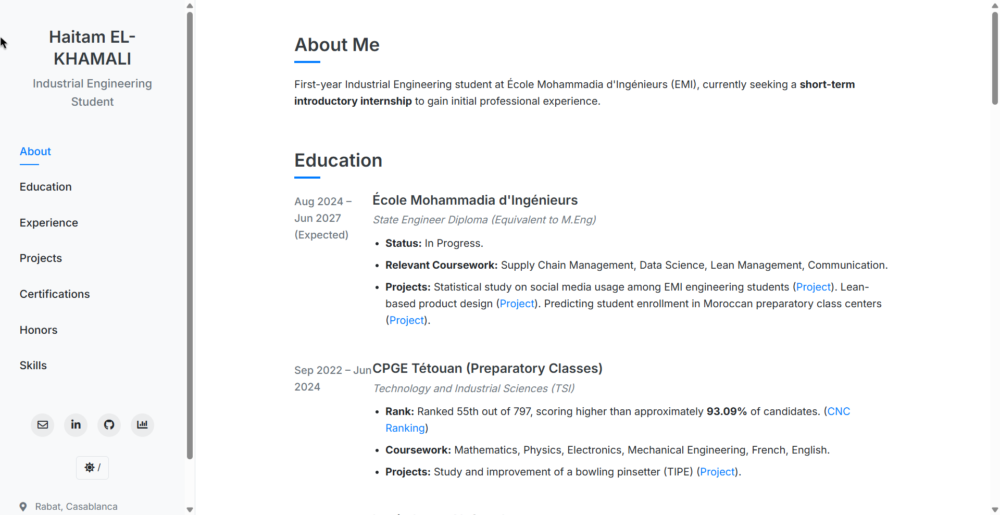

# Haitam EL-KHAMALI - Personal Portfolio Website

This repository contains the source code for Haitam EL-KHAMALI's personal portfolio website, hosted on GitHub Pages.

## Overview

This project is Haitam EL-KHAMALI's personal portfolio website, meticulously crafted to serve as a dynamic and comprehensive digital resume. Hosted on GitHub Pages, it offers an engaging platform for visitors, including potential employers, collaborators, and mentors, to explore Haitam's academic achievements, professional experiences, noteworthy projects, earned certifications, and diverse skill set. 

The primary goal of this website is to present a clear, well-structured, and aesthetically pleasing overview of Haitam's capabilities and journey as an ambitious Industrial Engineering student. It aims to go beyond a traditional paper resume by providing interactive elements, direct links to relevant work and profiles, and a more in-depth look into his personal and professional development, particularly highlighting experiences like the McKinsey Forward Program.

Designed with user experience in mind, the site features intuitive navigation, responsive design for accessibility across all devices, and customizable viewing options like theme toggling. It is intended to be a living document, regularly updated to reflect Haitam's continuous growth, learning, and accomplishments in his field.

## Features

*   **Responsive Design:** The website is built with a responsive layout, ensuring optimal viewing on various devices (desktops, tablets, and mobile phones).
*   **Interactive Navigation:** A clear and user-friendly sidebar allows for easy navigation between different sections of the portfolio.
*   **Smooth Scrolling:** Implemented for a better user experience when navigating through sections.
*   **Active Link Highlighting:** The current section being viewed is highlighted in the navigation menu.
*   **Theme Toggling:** Users can switch between light and dark themes based on their preference.
*   **Detailed Sections:** 
    *   **About Me:** A brief introduction.
    *   **My Journey:** A detailed account of Haitam's personal and professional development story, including insights from the McKinsey Forward Program.
    *   **Education:** Information about academic qualifications and institutions.
    *   **Experience:** Details of professional roles and responsibilities.
    *   **Projects:** Showcase of key projects undertaken.
    *   **Certifications:** List of licenses and certifications obtained.
    *   **Honors & Awards:** Recognition of achievements.
    *   **Skills:** Overview of technical and soft skills.
*   **Contact Information:** Easy access to email, LinkedIn, GitHub, and DataCamp profiles.

## Technologies Used

*   HTML5
*   CSS3 (with custom properties/variables for theming)
*   JavaScript (for interactivity like theme toggling, smooth scrolling, and active navigation highlighting)
*   Font Awesome (for icons)
*   Google Fonts (Inter)

## Structure

*   `index.html`: The main HTML file containing the structure and content of the website.
*   `styles.css`: The CSS file for styling the website, including theme definitions.
*   `script.js`: The JavaScript file for all interactive functionalities.
*   `README.md`: This file, providing an overview of the project.

## Future Enhancements (Potential)

*   Addition of a blog section.
*   More detailed project pages with image galleries or demos.
*   Integration of a contact form.

This website is continuously updated as Haitam progresses in his career and academic pursuits.

## Website Preview

